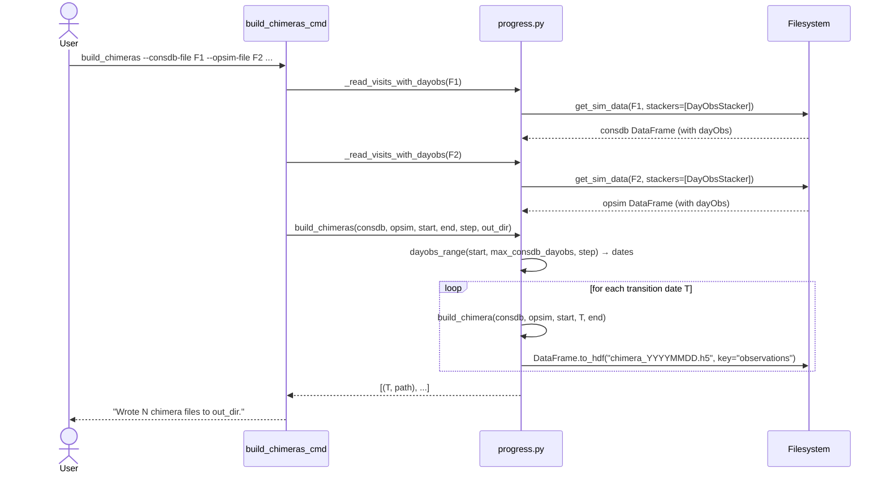
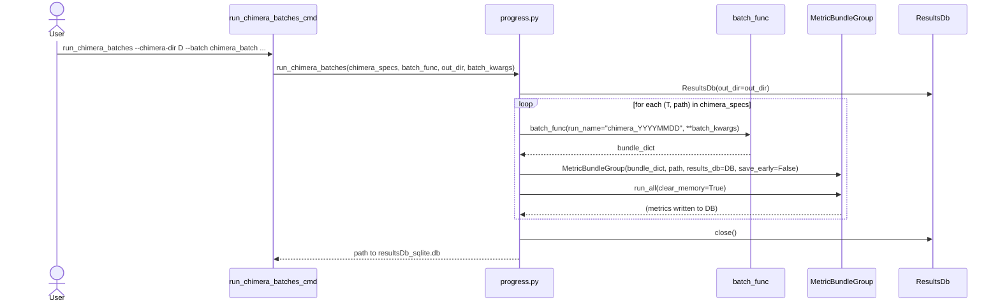
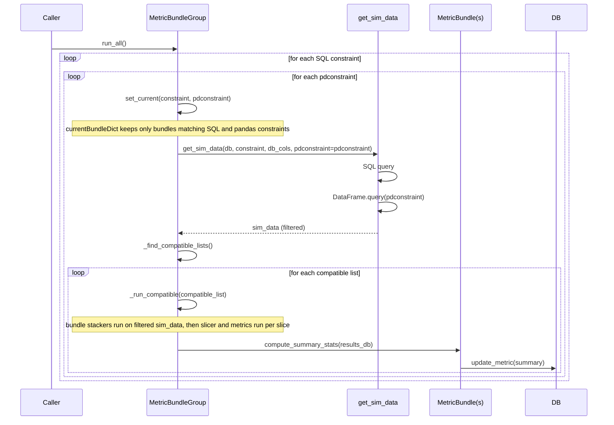

# SP-3142 — Adapt rubin_sim.maf.batch infrastructure for progress measurement

| Field | Value |
|-------|--------|
| **Issue** | [SP-3142](https://rubinobs.atlassian.net/browse/SP-3142) |
| **Branch** | `tickets/SP-3142` |
| **Author** | Eric H. Neilsen, Jr. |
| **Status** | Implementation and Documentation Complete; Final Closeout Pending |
| **Scope Tier** | T2 |
| **QA Level** | Low |
| **Estimate** | 2 days |
| **Created / Updated** | 2026-09-25 / 2026-10-05 |

---

## 1. Abstract

<!--

Summarize the problem and proposed solution. Required for every tier; 3–5 sentences for T2, shorter for T1 (process §2.3).
Prompts:
- What problem is being solved?
- What is the proposed approach?
- Who benefits and how?

-->

We are adapting MAF's metric bundle and batch infrastructure to track LSST survey progress. ("LSST" now refers to the survey being performed by
Rubin Observatory, while it used to refer to the whole project.)
The progress reports described in RTN-092 need metric values as a function of date in two forms: values measured on the visits completed as of each date, and values extrapolated to a target date (e.g. the end of the survey), measured on "chimera" visit sequences that combine completed visits up to each date with baseline-simulated visits after it.
This issue adds `rubin_sim` commands that build chimera visit sequences from a set of completed visits and a baseline simulation, run a set of progress-tracking metric batches over a series of dates on completed visits, chimeras, and the baseline, and record the resulting summary statistics in MAF results databases from which the scheduling team and others can make progress plots.
To keep evaluation of the same metrics at many dates fast, subsets of visits by date and band are selected with pandas queries (a new `pdconstraint` on metric bundles) rather than SQL queries so they can be applied to visits from hdf5 files without conversion to sqlite3 databases.
Creation of the plots themselves is outside the scope of this issue; that will be a separate issue in `schedview`.

### 1.1 Scope

<!--
Written by the developer, by hand, before anything else (process §5.1) — restating scope is how you find out whether you understand it.
-->


**In scope.**
- Generation of chimera visit sequences: completed (consdb) visits through each transition `dayObs` followed by baseline visits after it, excluding visits from either source with `fiveSigmaDepth` either missing, `NaN`, or at or below `FIVE_SIGMA_DEPTH_LIMIT` (default 0.0), written one HDF5 file per transition date, with a `simulated` column marking the source of each visit (`build_chimera`, `build_chimeras`).
- Measuring metrics in each chimera (`run_chimera_batches`, `chimera_batch`) and as of a series of dates in snapshots (completed visits through each date) and the baseline.
- Defining the metrics to be measured: the progress-tracking batches (`snapshot_batch`, `chimera_batch`) that supply the data for RTN-092's "Scalar metric vs. time" and "Extrapolated metric vs. time" plots (e.g. coadded depth and visit-count area statistics per band, fO metrics).
- Recording results for each series of dates in a single MAF `ResultsDb` with run names that encode the date (`<prefix>_YYYYMMDD`), and extracting a per-date summary table (`make_chimera_summary_table`).
- Command-line entry points for the above (`build_chimeras`, `run_chimera_batches`, `run_progress_batches`, `make_chimera_summary_table`).
- Supporting MAF changes:
  - a `pdconstraint` (pandas query applied after the SQL query) in `get_sim_data`/`get_visit_data`, `MetricBundle`, and `MetricBundleGroup`, so that date and band subsets are selected in pandas rather than with SQLite, for performance;
  - a `dayobs0` argument to `science_radar_batch`, as an alternative to `mjd0`, so that it can be used for progress tracking in the same way as other batches.

**Out of scope.**
<!-- The tempting adjacent things you are deliberately NOT doing. Nothing in later
     sections may fall in this list — an agent that drifts here should be stopped. -->
- Visualizing the metrics (a separate `schedview` issue).
- Generating new baselines.
- Getting the list of visits themselves. (These will be provided in a visits database.)
- "Bespoke" visit sequences (custom simulations started at each date with completed visits pre-loaded; see RTN-092). Only chimeras are built here.
- New MAF metric classes; the batches use existing metrics and summary metrics.
- Data-quality cuts other than the shared `FIVE_SIGMA_DEPTH_LIMIT` threshold (default 0.0), e.g. additional quality criteria.
- Automating the routine initialization of the process (e.g. writing a cron job to do it is out of scope).


**Done when.**
<!-- One sentence. -->
Starting from a file of completed visits and a baseline opsim file, the new commands produce MAF results databases containing the available progress metrics for the requested dates for snapshots, chimeras, and the baseline, with tests passing.

---

## 2. Concept of Operations

<!--
Written first by the developer before AI elaboration.
Prompts:
- Operational scenarios
- Actors and workflows
- Intended system behavior
- Assumptions and constraints
- Changes relative to current behavior

-->

**Actors and inputs.** Members of the scheduling team run these commands by hand whenever up-to-date progress figures are needed, for example for a report or meeting. (Automating them, e.g. in a cron job, is out of scope.)
The user supplies two visit files in the opsim schema (SQLite or HDF5):
- the completed visits, extracted from consdb;
- the baseline simulation against which progress is measured.

The baseline is assumed to be aligned with the actual survey start, so that values at the same `dayObs` can be compared.

**Workflow.** Dates are integer `dayObs` values (`YYYYMMDD`, UTC−12). The snapshot command's end date is the last snapshot date; for chimera construction, `end_dayobs` is the extrapolation target for baseline visits, not a cap on transition dates. The commands also take a start date and a step in nights.

1. *Snapshots.* `run_progress_batches` on the completed-visits file evaluates `snapshot_batch` at each date, using only visits through that date. Results for nonempty selections go to a `ResultsDb` with runs named `consdb_YYYYMMDD`; dates before the first qualifying visit need not have database rows.
2. *Baseline.* Running the same command on the baseline file (e.g. with `--run-prefix baseline`) gives baseline values at the same dates for comparison. Steps 1 and 2 together supply the data for RTN-092's "Scalar metric vs. time" plots. When this run's end date is the chimera target date, its last snapshot (`baseline_<target date>`) is the baseline value extrapolated to that date. The downstream visualizer reads that snapshot as the baseline reference line on the "Extrapolated metric vs. time" plots, so no separate baseline extrapolation run is needed. The fO metrics are the exception. They are not measured on snapshots, and their baseline values come from the baseline selection and acceptance process, outside progress tracking (Q-5).
3. *Chimeras.*
   - `build_chimeras` writes one `chimera_YYYYMMDD.h5` file per transition date. Each file holds the completed visits through that date, followed by baseline visits from after it up to the requested end date (e.g. the end of the survey or a data-release cutoff). The last transition date is always the most recent night of completed visits; `end_dayobs` does not truncate the completed-visit sequence or restrict the transition dates.
   - `run_chimera_batches` runs a batch on every chimera. This can be `chimera_batch`, or an existing batch such as `science_radar_batch` given `--batch-kwarg dayobs0=<survey start>`.
   - `make_chimera_summary_table` pivots the summary statistics into one row per transition date. This supplies the data for the "Extrapolated metric vs. time" plots.

**Example shell workflow.** Assume the current directory contains `completed.db`, a completed-visits database queried from consdb, and `baseline.db`, the baseline opsim database. Set the observing-day dates for the data: `START_DAYOBS` is the survey start, `LAST_CONSDB_DAYOBS` is the latest completed observing day, and `TARGET_DAYOBS` is the date through which the baseline should be used for extrapolation. For example:

```bash
CONSDB_VISIT_DB="completed.db"
BASELINE_DB="baseline.db"
START_DAYOBS=20251001
LAST_CONSDB_DAYOBS=20260713
TARGET_DAYOBS=20361001
STEP=30
CHIMERA_DIR=./chimeras
RESULTS_DIR=./results

# Build one chimera per transition date, using baseline visits through the target.
build_chimeras \
  --consdb-file "${CONSDB_VISIT_DB}" \
  --opsim-file "${BASELINE_DB}" \
  --start-dayobs "$START_DAYOBS" \
  --end-dayobs "$TARGET_DAYOBS" \
  --step "$STEP" \
  --out-dir "$CHIMERA_DIR"

# Measure extrapolated metrics on every chimera.
run_chimera_batches \
  --chimera-dir "$CHIMERA_DIR" \
  --batch chimera_batch \
  --out-dir "$RESULTS_DIR"

# Measure as-completed snapshots through the latest consdb date.
run_progress_batches \
  --visits-file "${CONSDB_VISIT_DB}" \
  --start-dayobs "$START_DAYOBS" \
  --end-dayobs "$LAST_CONSDB_DAYOBS" \
  --step "$STEP" \
  --run-prefix consdb \
  --out-dir "$RESULTS_DIR"

# Measure baseline snapshots on the same cadence.
run_progress_batches \
  --visits-file "${BASELINE_DB}" \
  --start-dayobs "$START_DAYOBS" \
  --end-dayobs "$LAST_CONSDB_DAYOBS" \
  --step "$STEP" \
  --run-prefix baseline \
  --out-dir "$RESULTS_DIR"

# Pivot the chimera summaries by transition date for the extrapolated plots.
make_chimera_summary_table \
  --results-db "$RESULTS_DIR/resultsDb_sqlite.db" \
  --out-file "$RESULTS_DIR/chimera_summary.h5"
```

All three metric commands write to the same `resultsDb_sqlite.db`: it contains `chimera_YYYYMMDD` runs plus `consdb_YYYYMMDD` and `baseline_YYYYMMDD` snapshot runs. The summary-table command writes a separate HDF5 table from the chimera runs in that database. Replace the example dates and step with the dates and cadence appropriate to the input files; the baseline end date is the extrapolation target, while the consdb snapshot end date is the latest completed observing day.

Plotting code in `schedview` (a separate issue) will read the resulting `ResultsDb` files and summary tables to make figures for the progress-report audiences described in RTN-092.

**Assumptions and constraints.**
- Completed and baseline visits with null or non-positive `fiveSigmaDepth` are excluded, and a missing `exposures` value in completed visits is taken to be 1.
- `FIVE_SIGMA_DEPTH_LIMIT` in `maf/progress.py` defaults to 0.0 and provides the same initial data-quality cut for chimera construction and snapshots. It normally filters only completed visits because simulated visits generally have positive depth, but it applies to both sources. Additional quality cuts are out of scope.
- Chimeras are pessimistic, because they do not model how the scheduler would respond to the actual state of the survey (RTN-092).
- Visits may be loaded from hdf5 files instead of sqlite3 ones, and conversion to sqlite3 so that SQL queries can be run is slow, so date and band subsets are selected in memory with pandas queries rather than with SQLite queries.

**Changes relative to current behavior.** MAF currently runs a batch once per visit database, and has no tooling for evaluating metrics at a series of dates or on sequences that mix completed and simulated visits. The new commands add both. Existing batches and MAF callers are unaffected, because `pdconstraint` and `dayobs0` are optional and their defaults preserve the previous behavior.

---

## 3. External Requirements and Design Evaluation Criteria

<!--
Guidance (T2): at most 8 requirements (process §2.3).
-->

### 3.1 External Requirements

<!--
Atomic, verifiable success criteria. Each requirement must be one that a test can demonstrate — if you cannot say how it would be tested, it is not yet stated precisely enough. The verification method itself is specified in Architecture and Design (§6), not here; this section states *what* must hold, §6 states *how it will be shown to hold*.
Prompts:
- Functional requirements
- Performance requirements
- Interface/API requirements
- Environmental or mission constraints
-->

Dates are integer `dayObs` values as defined in [SITCOMTN-032](https://sitcomtn-032.lsst.io/): the `YYYYMMDD` date, in timezone UTC−12, on which an exposure began. Observing day D therefore runs from 12:00 UTC on calendar date D to 12:00 UTC on the following date. S and T are the start and transition dates, E is the target date through which baseline visits are included in a chimera, and N is a step in nights. E does not bound T or the completed visits.

**R-1 Chimera contents.** Before selecting common columns, `build_chimera` normalizes the completed-visits input by adding an `exposures` column with value 1 if the column is absent, and filling null values in an existing `exposures` column with 1. It returns exactly the following rows, restricted to columns common to the normalized completed-visits and baseline inputs, plus `simulated`:
- the completed visits with S ≤ `dayObs` ≤ T and `fiveSigmaDepth` > `FIVE_SIGMA_DEPTH_LIMIT`, with `simulated` = False; followed by
- the baseline visits with T < `dayObs` ≤ E and `fiveSigmaDepth` > `FIVE_SIGMA_DEPTH_LIMIT`, with `simulated` = True.

The `simulated` column is kept for debugging; no batch or command depends on it.

**R-2 Chimera series.** `build_chimeras` writes one HDF5 file, `chimera_YYYYMMDD.h5` (key `observations`), for each transition date from S in steps of N nights through the last `dayObs` of completed visits. If the step does not land on that last date, it writes a file for that date as well. `end_dayobs` limits baseline visits in each file, not the transition-date series or completed visits. Each file can be used directly as the visits source of a `MetricBundleGroup`.

**R-3 Snapshots.** `snapshot_batch(end_dayobs=D)` computes metrics from exactly those visits that:
- have `fiveSigmaDepth` > `FIVE_SIGMA_DEPTH_LIMIT` (defined in `maf/progress.py`, default 0.0); and
- have `observationStartMJD` before the end of observing day D (i.e. `dayObs` ≤ D), or any `observationStartMJD` if `end_dayobs` is `None`.

The caller must choose `nside` for the HEALPix slicers high enough that every pointing of the LSST camera footprint covers at least one HEALPixel. If this condition does not hold and an empty-map minimum reduction raises the `ValueError` described in targeted review F-1, `run_progress_batches` warns with the affected run name and continues to subsequent snapshots. The affected snapshot may have incomplete results; already recorded rows are retained. Unrelated `ValueError` exceptions are not suppressed.

`run_progress_batches` runs `snapshot_batch` at each date D from S in steps of N nights, plus the end date. Snapshot selection does not use a `simulated` column, so the same command works on both a completed-visits file and a baseline opsim file. The shared `FIVE_SIGMA_DEPTH_LIMIT` cut is a data-quality filter (see §2). When D precedes the first qualifying visit, the run need not produce any `ResultsDb` rows for D.

**R-4 Progress metrics.** The caller must choose `nside` for the HEALPix slicers high enough that every pointing of the LSST camera footprint covers at least one HEALPixel. Metric completeness assumes this resolution condition; snapshot-series recovery when it is violated is specified in R-3. `snapshot_batch` and `chimera_batch` compute the following for each band u, g, r, i, z, y, and for all bands combined:
- the total effective exposure time and the number of visits;
- HEALPix maps of visit count and coadded five-sigma depth, each summarized by:
  - the standard summary statistics;
  - the minimum over the best 18,000 deg²;
  - the 10th percentile.

`chimera_batch` also computes the fO metrics:
- fOArea and fONv, both raw and normalized to the 18,000 deg² / 825-visit benchmark;
- the area with at least 750 visits.

**R-5 Results storage.** Each run command writes results for its date series to a single MAF `ResultsDb` in its output directory. Run names for recorded results take one of two forms, where `YYYYMMDD` is the snapshot or transition date:
- snapshots: `<prefix>_YYYYMMDD`. The prefix defaults to `consdb` and can be set by the user, e.g. to `baseline`.
- chimeras: `chimera_YYYYMMDD`.

`make_chimera_summary_table` writes to HDF5 a table with one row per chimera transition date (integer index) and one column per (metric name, slicer, info label, summary metric).

**R-6 Command-line interface.** Installing `rubin_sim` provides the console commands `build_chimeras`, `run_chimera_batches`, `run_progress_batches`, and `make_chimera_summary_table`. The two `run_*` commands select a batch function in `rubin_sim.maf.batches` by name (`--batch`) and accept repeated `--batch-kwarg KEY=VALUE` options, whose values are parsed as Python literals where possible. `run_progress_batches` supports batch functions that accept both `run_name` and `end_dayobs` keyword arguments; `run_chimera_batches` supports batch functions that accept `run_name` or the legacy `runName` keyword argument.

An unknown batch name or a malformed `--batch-kwarg` exits with a non-zero status.

**R-7 Pandas constraints.** `get_sim_data`, `get_visit_data`, and `MetricBundle` accept an optional `pdconstraint`: a `pandas.DataFrame.query` string applied after any SQL constraint.
- A `MetricBundleGroup` computes each bundle from only the visits that satisfy both its SQL constraint and its `pdconstraint`.
- A `pdconstraint` may reference only explicitly requested database columns (not columns produced by stackers). It does not request additional columns automatically. Bundle callers must ensure predicate columns are in `bundle.db_cols` before group construction, either through metric/slicer/stacker input requirements or by explicitly adding them. Direct utility callers must include predicate columns in `dbcols` when specifying a projection. An omitted column may cause the query to fail; incidental availability, such as an unprojected HDF5 read, is not guaranteed.
- With no `pdconstraint`, results are unchanged from before this issue.

**R-8 `dayobs0` and backward compatibility.** `science_radar_batch(dayobs0=D)` returns the same bundles as `science_radar_batch(mjd0=m)`, where m is the MJD at which observing day D begins: 12:00 UTC on date D, e.g. 61220.5 for D = 20260629, equal to `rubin_scheduler.utils.SURVEY_START_MJD`.
- Passing both with inconsistent values raises `ValueError`.
- Passing neither behaves as before this issue.

**R-9 Performance.** Running `chimera_batch` on one ten-year chimera (about 2 million visits) completes in under 1 hour on a SLAC S3DF batch node in the `milano` partition.

### 3.2 Design Evaluation Criteria

Omitted. The one genuine alternative was to select date and band subsets with pandas queries rather than SQL constraints. The developer chose pandas for performance; this is recorded in §5 (CDD-2).

---

## 4. Context

- MAF evaluates metrics through `MetricBundle` objects. A bundle combines an existing metric, slicer, optional SQL `constraint`, optional stackers, summary metrics, plotting metadata, and a `run_name`. Its constructor and `set_run_name` establish the metadata later written with metric results.
- `MetricBundle._find_req_cols` currently determines database columns from the metric, slicer, and explicitly configured stackers. It also discovers default stackers through `ColInfo` when those components require derived columns. This is the natural extension point for any new bundle-level filtering metadata.
- `MetricBundleGroup` accepts a bundle dictionary and one database or visits-file source. Before this issue, `run_all` iterates over the group's SQL constraints and calls `run_current`, which calls `set_current` (selecting bundles with that constraint), `get_data` (one shared fetch of the database columns needed by those bundles), `_find_compatible_lists`, `_run_compatible`, reduction, summary statistics, and optional plotting. Compatibility considers the SQL constraint, slicer, maps, and stacker interactions. Bundle stackers run in `_run_compatible`, after the fetch. A caller can also pass `sim_data` directly to `run_current`.
- `get_sim_data` and `get_visit_data` in `maf/utils/opsim_utils.py` read opsim-schema data from SQLite, SQLite connections, or HDF5 files. HDF5 sources use the `observations` table/key. `get_sim_data` returns a NumPy record array by default; `get_visit_data` returns a pandas DataFrame by default.
- The local data-loading path builds a SQL `SELECT`, reads the rows, and applies any supplied stackers. It raises a `UserWarning` when the SQL query returns no rows and a `ValueError` when requested columns are unavailable.
- Existing batch functions are exported from `maf/batches/__init__.py` and from the top-level `maf` namespace. They conventionally return a dictionary of `MetricBundle` objects and set each bundle’s run name. Naming is not uniform: `glanceBatch` accepts `run_name`, while several older batches, including `science_radar_batch`, use `runName`.
- `glanceBatch` in `maf/batches/glance_batch.py` is an existing general-purpose batch that accepts `run_name`, `colmap`, `nside`, filter names, and other metric options. It can serve as the default batch for a new orchestration function that runs metrics on multiple visits files.
- `science_radar_batch` in `maf/batches/science_radar_batch.py` accepts `mjd0=None` and passes that value to time-dependent transient metrics, including TDE and XRB-related metrics. Before this issue it has no `dayobs0` parameter; its existing no-argument behavior is part of the compatibility surface.
- `DayObsStacker` already exists in `maf/stackers/date_stackers.py`. It adds an integer `dayObs` column from an observation MJD column, using the SITCOMTN-032 UTC−12 observing-day convention. The default required input column is `observationStartMJD`; the output column is not necessarily present in an input visits database.
- Existing batch helpers in `maf/batches/common.py` provide standard summary metrics. Existing MAF metrics and slicers provide HEALPix maps, visit counts, coadded five-sigma depth, effective exposure calculations, area summaries, percentile summaries, and fO calculations; this issue can compose those instead of adding metric classes.
- `ResultsDb` in `maf/db/results_db.py` creates or opens `resultsDb_sqlite.db` in an output directory. `MetricBundleGroup` accepts a `ResultsDb` instance, allowing several groups to write metric and summary rows to one database. Results are associated with run names stored in the database.
- The repository already supports pandas and HDF5 through its runtime dependencies and already uses click for an existing optional command. Before this issue, `pyproject.toml` contains no progress-specific console scripts and `maf` contains no progress orchestration module.
- `MetricBundleGroup.run_current` catches `ValueError` from `get_data`, warns that requested columns were unavailable, and skips the constraint.
- Existing tests for MAF bundles, opsim utilities, batches, stackers, and ResultsDb provide the verification patterns. In particular, bundle tests exercise required-column discovery and group compatibility; opsim utility tests exercise SQLite/HDF5 loading and return types; batch tests exercise returned bundle dictionaries. No pre-existing tests cover chimera construction, date-series batch execution, progress batches, or progress-specific command-line interfaces.

---

## 5. Critical Design Decisions (when applicable)

<!--
List key decisions where **genuine alternatives** exist. Guidance
(T2): at most 3 decisions. Omit this section when no genuine
alternative exists; a single plausible option belongs in Architecture
and Design (§6) as a design fact, not here (process §2.3, §2.4).
Prompts:
- Decision question
- Options considered
- Final choice and rationale
- Risks and alternatives
-->

**CDD-1. How chimera visit sequences are constructed.**
- *Question:* Should chimeras be built as stored files before metrics
  are measured, or assembled in memory when metrics are measured?
- *Options:*
  - (a) *Materialize.* A separate step (`build_chimeras`) writes one
    file per transition date. The metric step then reads each file as
    an ordinary visits source.
  - (b) *On the fly.* MAF's data access reads completed visits through
    the transition date from the consdb file and baseline visits after
    it from the opsim file. It combines them in memory for each metric
    run.
- *Choice:* (a).
- *Rationale:*
  - `MetricBundleGroup` accepts a single visits source. Option (b)
    would require significant changes to MAF data access to merge two
    sources with different schemas.
  - With option (a), each chimera file is a valid opsim-schema
    source. Any existing batch, such as `science_radar_batch`, can
    therefore run on it unchanged (R-2).
  - The files can be inspected directly, using the `simulated` column,
    when a result needs debugging.
- *Risks and consequences:*
  - Disk use grows with the number of transition dates, because
    completed visits are duplicated across files.
  - The files become stale when the completed visits or the baseline
    change, and must be rebuilt by rerunning `build_chimeras`.

**CDD-2. How snapshots at a series of dates are selected.**
- *Question:* Should snapshot metrics be measured on truncated copies
  of the visit files, or on the full files restricted by constraints?
- *Options:*
  - (a) *Truncated copies.* Write one truncated copy of the consdb or
    baseline file per snapshot date.
  - (b) *Constraints.* Read the full file and restrict each bundle to
    visits through the snapshot date using a constraint.
- *Choice:* (b), with date and band subsets expressed as pandas
  `pdconstraint` strings rather than SQL constraints.
- *Rationale for (b):*
  - This is the opposite of CDD-1 for a structural reason. Truncating
    a single source is already supported by MAF's constraint
    mechanism, whereas combining two sources is not.
  - No intermediate files are needed.
  - The same command serves both completed visits and the baseline
    (R-3).
- *Rationale for pandas over SQL:*
  - Visits may be loaded from either hdf5 files or SQLite3 database. Application of SQL queries to visits loaded from hdf5 files requires conversion to SQLite3, which is a slow process. Application of constrants applied using pandas queries is a fast process in either case.
- *Risks and consequences:*
  - MAF needs new `pdconstraint` support in `get_sim_data`,
    `get_visit_data`, `MetricBundle`, and `MetricBundleGroup` (R-7).
  - A `pdconstraint` can reference only database columns, because it
    is applied before stackers run (Q-3). This is enough for the
    progress batches, which filter only on `fiveSigmaDepth`,
    `observationStartMJD`, and `band`.
  - Behavior with no `pdconstraint` must remain unchanged.

**CDD-3. Where progress metrics are computed.**
- *Question:* Should metrics be computed in advance with MAF batches
  and stored for later visualization, or computed by `schedview` when
  figures are made?
- *Options:*
  - (a) *Precompute.* Run MAF batches ahead of time, write `ResultsDb`
    files, and have `schedview` read them.
  - (b) *On demand.* Incorporate metric measurement into `schedview`
    and compute on demand.
- *Choice:* (a).
- *Rationale:*
  - Processing takes long enough (R-9) that a distinct processing step
    with saved results is needed in either case.
  - MAF's batch structure is already close to what is needed.
  - Existing batches can be reused in their entirety.
- *Risks and consequences:*
  - `schedview` depends on the `ResultsDb` schema and on the run-name
    conventions of R-5, so changes to either require coordinated changes.
  - Figures are only as current as the most recent manual run of the
    commands.

## 6. Architecture and Design

- [x] Design reviewed and approved by _____EHN_______ on
      __2026-09-29____ .
- [x] Amended design (Amendment 1, 2026-09-29; see §10) reviewed and
      re-approved by ______EHN______ on ___2026-09-30__ .
- [x] Amendment 2 approved by EHN on 2026-10-05: reject bundles with
      different `pdconstraint` values but the same `ResultsDb` identity,
      requiring distinct `info_label` values without changing persistence
      or file-naming rules; make `click` a required dependency, including
      in `requirements.txt`. This approval reconciles the already implemented
      changes with the design; it does not establish approval before those
      changes were implemented or replace their review and verification.

*Process note.* This issue was started before the issue process was
adopted. The process itself is still under development, and work on
the issue had paused. The IWD was bootstrapped partway through
implementation so that the remaining work could follow the process.
As a result, much of the code predates the design approval above. The
approval covers the design as reconstructed from, and reconciled
with, that code.

- [x] Amendment 3 approved by EHN on 2026-10-05: remove
      `_cols_from_pdconstraint` and automatic predicate-column discovery.
      Callers must explicitly request predicate database columns; bundle
      callers may add them to `bundle.db_cols` before group construction.
      Progress batches explicitly request depth, date, and band columns.
      Verify pandas functions/accessors on requested columns and failure
      for an omitted column. Developer direction preceded implementation.

### Design Summary

- [x] Amendment 4 approved by EHN on 2026-10-05 before implementation:
      R-3/R-4 require HEALPix resolution sufficient for every LSST camera
      pointing to cover at least one pixel. Catch only the empty-array
      minimum-reduction ValueError around each snapshot's `group.run_all`,
      warn with the run name and incomplete-results notice, and continue
      later dates. Retain partial results; propagate unrelated errors.
      Verify a real sparse first snapshot and successful later snapshot.

	The implementation adds infrastructure in four areas, all backward-compatible:

1. **Progress batch functions** (`maf/batches/progress_batch.py`): `snapshot_batch` and `chimera_batch` use `pdconstraint` strings for date-and-band subsetting rather than SQL.
2. **Progress-tracking commands** (`maf/progress.py`): Python functions and click CLI commands to build chimera sequences and run batches over date ranges, sharing a single `ResultsDb` per run. The module defines `FIVE_SIGMA_DEPTH_LIMIT = 0.0` for both chimera construction and snapshot selection.
3. **`pdconstraint` support** in `MetricBundle`, `MetricBundleGroup`, `get_sim_data`, and `get_visit_data`: a `pandas.DataFrame.query` string applied after the SQL query, before bundle stackers run, and referencing explicitly requested database columns only. No predicate parsing or automatic predicate-column fetch occurs. Bundle callers may explicitly add columns to `bundle.db_cols`; progress batches request their depth, date, and band columns. Direct utility callers include predicate columns in their projection.
4. **`dayobs0` in `science_radar_batch`**: an alternative to `mjd0` that accepts a `dayObs` integer.

Every new parameter defaults to `None` or `""`, which reproduces previous behavior. Existing callers are unaffected.

### Components and Responsibilities

| Component | File | Role |
|---|---|---|
| `progress_batch` | `maf/batches/progress_batch.py` | `snapshot_batch` and `chimera_batch` |
| `progress` | `maf/progress.py` | Chimera building, date-range batch running, summary table, click CLIs |
| `MetricBundle` | `maf/metric_bundles/metric_bundle.py` | Stores `pdconstraint`; callers explicitly add any additional predicate columns to `db_cols` |
| `MetricBundleGroup` | `maf/metric_bundles/metric_bundle_group.py` | Groups bundles by (SQL constraint, pdconstraint); fetches data per group and passes the pdconstraint to `get_sim_data` |
| `_local_get_sim_data` / `get_sim_data` / `get_visit_data` | `maf/utils/opsim_utils.py` | Applies pdconstraint after the SQL query (and after any explicitly supplied stackers); direct calls with an explicit projection are not required to succeed if it omits a referenced column |
| `science_radar_batch` | `maf/batches/science_radar_batch.py` | Accepts `dayobs0` as alternative to `mjd0` |
| `DayObsStacker` (existing, unchanged) | `maf/stackers/date_stackers.py` | Used by `build_chimeras_cmd` to add `dayObs` to both inputs before chimera construction; not usable in a pdconstraint |

### Interfaces

#### `rubin_sim.maf.batches.progress_batch`

```python
def snapshot_batch(
    colmap: dict[str, str] | None = None,
    run_name: str = "run_name",
    nside: int = 32,
    bands: Sequence[str] = ("u", "g", "r", "i", "z", "y"),
    label_prefix: str = "snapshot",
    end_dayobs: int | None = None,
) -> dict[str, MetricBundle]
```
Each bundle's `pdconstraint` is `fiveSigmaDepth > {FIVE_SIGMA_DEPTH_LIMIT}[ and observationStartMJD < {end_mjd}][ and band == '{X}']`, where the limit is defined in `maf/progress.py` (default 0.0) and `end_mjd = MJD(end_dayobs 00:00 UTC) + 1.5` (12:00 UTC on calendar day `end_dayobs + 1`, i.e. the end of observing day `end_dayobs`). The MJD clause is omitted when `end_dayobs` is `None`.

```python
def chimera_batch(
    colmap: dict[str, str] | None = None,
    run_name: str = "run_name",
    nside: int = 32,
    bands: Sequence[str] = ("u", "g", "r", "i", "z", "y"),
    label_prefix: str = "chimera",
) -> dict[str, MetricBundle]
```
Returns per-band bundles with `pdconstraint = "band == '{X}'"`, an all-band bundle with `pdconstraint = ""`, and one fO bundle with no pdconstraint. The fO slicer and summary metrics use the requested `nside`.

Internal helpers (not in `__all__`):

```python
def _make_base_progress_bundle_list(
    pdconstraints: dict[str, str],
    colmap: dict[str, str] | None = None,
    nside: int = 32,
) -> list[MetricBundle]

def _make_fO_bundle(nside: int = 32, colmap: dict[str, str] | None = None) -> MetricBundle
```

#### `rubin_sim.maf.progress`

```python
def dayobs_range(
    start_dayobs: int,
    end_dayobs: int,
    step: int = 1,
) -> list[int]
# List of YYYYMMDD integers from start to end inclusive, spaced by step nights.
# Raises ValueError if step <= 0.

def build_chimera(
    consdb_visits: pd.DataFrame,   # must have dayObs column
    opsim_visits: pd.DataFrame,    # must have dayObs column
    start_dayobs: int,
    transition_dayobs: int,
    end_dayobs: int,
) -> pd.DataFrame
# Returns common columns after completed-visits exposures normalization,
# plus simulated (bool).
# consdb rows: start_dayobs <= dayObs <= transition_dayobs,
#   fiveSigmaDepth > FIVE_SIGMA_DEPTH_LIMIT, exposures NaN->1, simulated=False.
# opsim rows: transition_dayobs < dayObs <= end_dayobs,
#   fiveSigmaDepth > FIVE_SIGMA_DEPTH_LIMIT, simulated=True.
# Raises ValueError if inputs share no common columns.

def build_chimeras(
    consdb_visits: pd.DataFrame,
    opsim_visits: pd.DataFrame,
    start_dayobs: int,
    end_dayobs: int,
    step: int = 1,
    out_dir: str = ".",
) -> list[tuple[int, str]]
# Writes chimera_YYYYMMDD.h5 (key "observations", complevel=5) per transition date.
# Transition dates = dayobs_range(start_dayobs, max(consdb dayObs), step),
# plus max(consdb dayObs) if not already last.
# end_dayobs bounds baseline visits only; it does not cap transition dates.
# Returns [(transition_dayobs, path), ...].

def run_chimera_batches(
    chimera_specs: list[tuple[int, str]],
    batch_func: Callable[..., dict] | None = None,  # default: glanceBatch
    out_dir: str = ".",
    batch_kwargs: dict | None = None,
) -> str
# Runs batch_func per chimera with run_name="chimera_YYYYMMDD".
# Falls back from run_name= to runName= for legacy batches.
# All runs share one ResultsDb. Returns path to resultsDb_sqlite.db.

def run_progress_batches(
    visits_path: str,
    start_dayobs: int,
    end_dayobs: int,
    step: int = 30,
    out_dir: str = ".",
    run_prefix: str = "consdb",
    batch_kwargs: dict | None = None,
    batch_func: Callable[..., dict] | None = None,  # default: snapshot_batch
) -> str
# Runs batch_func once per date in dayobs_range(start, end, step),
# appending end_dayobs if not already last.
# run_name = f"{run_prefix}_{dayobs:08d}".
# batch_func must accept run_name and end_dayobs keyword arguments.
# All runs share one ResultsDb. Returns path to resultsDb_sqlite.db.

def make_chimera_summary_table(
    results_db: ResultsDb | str,
) -> pd.DataFrame
# Queries results_db for all "chimera_YYYYMMDD" run names, collects
# their summary stats, pivots to a wide DataFrame:
#   index:   transition_dayobs (int YYYYMMDD), sorted ascending
#   columns: 4-level MultiIndex (metric_name, slicer_name,
#            metric_info_label, summary_metric)
# Returns empty DataFrame if no chimera runs are found.
```

CLI commands (registered as console scripts):

| Command | Required options | Key optional options |
|---|---|---|
| `build_chimeras` | `--consdb-file`, `--opsim-file`, `--start-dayobs`, `--end-dayobs` | `--step` (default 1), `--out-dir` |
| `run_chimera_batches` | `--chimera-dir` | `--batch` (default `glanceBatch`), `--batch-kwarg KEY=VALUE` (repeatable), `--out-dir` |
| `run_progress_batches` | `--visits-file`, `--start-dayobs`, `--end-dayobs` | `--batch` (default `snapshot_batch`), `--run-prefix` (default `consdb`), `--step` (default 30), `--batch-kwarg` (repeatable), `--out-dir` |
| `make_chimera_summary_table` | `--results-db` | `--out-file` (default `chimera_summary.h5`) |

For `run_progress_batches`, `--batch` must name a batch accepting `run_name` and `end_dayobs`; for `run_chimera_batches`, it must accept `run_name` or `runName`. `--batch-kwarg` values are parsed with `ast.literal_eval`; non-parseable values are kept as strings. An unknown `--batch` name (one that does not resolve to a callable in `rubin_sim.maf.batches`) or a malformed `--batch-kwarg` exits with a non-zero status. Both `run_chimera_batches_cmd` and `run_progress_batches_cmd` verify the selected batch is callable.

#### Modified: `MetricBundle.__init__`

```python
def __init__(
    self, metric, slicer, constraint=None, stacker_list=None,
    run_name="run name", metadata=None, info_label=None,
    plot_dict=None, display_dict=None, summary_metrics=None,
    maps_list=None, file_root=None, plot_funcs=None,
    pdconstraint=None,          # NEW — stored as "" if None
)
```

`_find_req_cols` retains existing metric/slicer/stacker required-column discovery and does not inspect `pdconstraint`. Callers explicitly add additional predicate database columns to `bundle.db_cols` before group construction. Explicit additions are fetched directly, without resolving them through `ColInfo` or generating them with stackers. Progress batches explicitly add mapped depth, date, and band columns.

`reduce_metric` propagates `pdconstraint` to the returned reduced `MetricBundle`.

`compute_summary_stats` now guards `self.metric_values is not None` before computing, preventing errors on bundles with no matching visits.

No predicate-column parser is provided (Amendment 3).

#### Modified: `MetricBundleGroup`

```python
# New instance attribute (set in __init__):
# self.pdconstraints: dict[str, list[str]]
#   Maps each SQL constraint to the list of distinct pdconstraint values
#   found among bundles with that constraint.

def set_current(self, constraint, pdconstraint=None)
# Now also filters currentBundleDict to bundles whose pdconstraint
# matches (None treated as "").

def run_all(self, clear_memory=False, plot_now=False, plot_kwargs=None)
# Now iterates over self.pdconstraints[constraint] for each constraint.

def run_current(
    self, constraint, sim_data=None, clear_memory=False,
    plot_now=False, plot_kwargs=None,
    pdconstraint=None,          # NEW
)

def get_data(self, constraint, pdconstraint=None)
# NEW behavior: passes pdconstraint to get_sim_data (without stackers),
# which applies DataFrame.query(pdconstraint) after the SQL query.
```

Two bundles are compatible only if they also have the same `pdconstraint` (in addition to same SQL constraint, slicer, maps, and non-conflicting stackers).

#### Modified: `get_sim_data` / `get_visit_data`

```python
def get_sim_data(
    db_con, sqlconstraint=None, dbcols=None, stackers=None,
    table_name=None, full_sql_query=None,
    *, pdconstraint=None,       # NEW (keyword-only)
    return_class=np.recarray,
) -> np.recarray | pd.DataFrame

def get_visit_data(
    db_con, sqlconstraint=None, dbcols=None, stackers=None,
    table_name=None, full_sql_query=None,
    *, pdconstraint=None,       # NEW (keyword-only)
    return_class=pd.DataFrame,
) -> pd.DataFrame | np.recarray
```

In `_local_get_sim_data`, execution order is: SQL query → stackers (if any) → `DataFrame.query(pdconstraint)`.
Unlike an SQL constraint, `pdconstraint` is evaluated against the fetched DataFrame. Callers must explicitly request predicate columns; neither utility nor bundle classes parse predicates or automatically fetch additional filter columns. Bundle callers add additional predicate columns to `bundle.db_cols` before group construction. An omitted column may cause query failure.

#### Modified: `science_radar_batch`

```python
def science_radar_batch(
    runName="run name", nside=64, benchmarkArea=18000,
    benchmarkNvisits=825, minNvisits=750,
    long_microlensing=True, srd_only=False,
    mjd0=None,
    dayobs0=None,               # NEW
) -> dict[str, MetricBundle]
# dayobs0 converted to mjd0 = MJD(dayobs0 00:00 UTC) + 0.5
# (= 12:00 UTC on date dayobs0, the start of observing day dayobs0).
# If both are given and disagree, raises ValueError.
# If neither is given, mjd0 remains None (existing behavior).
```

### Data Structures

**Chimera HDF5 file** (`chimera_YYYYMMDD.h5`): HDF5 key `observations`, `complevel=5`. Columns are the intersection of normalized consdb and opsim columns, plus `simulated` (bool). Before taking the intersection, a missing completed-visits `exposures` column is added with values of 1 and null values in that column are filled with 1. The file is directly readable by `get_sim_data` and `MetricBundleGroup`.

**`ResultsDb` run names**: snapshots use `{run_prefix}_{YYYYMMDD}` (default prefix `consdb`); chimeras use `chimera_{YYYYMMDD}`. An empty selection produces no metric results, so a snapshot date before the first qualifying visit need not appear in the database.

**`pdconstraint` strings**: `pandas.DataFrame.query`-compatible, with database columns explicitly requested separately. Column names containing spaces or SQL reserved words should be back-ticked (e.g. `` `filter` ``). No predicate parser restricts function or accessor syntax. External `@var` evaluation context is not supplied by the bundle interface.

**Summary table** (`make_chimera_summary_table`): indexed by `transition_dayobs` (int, sorted ascending); 4-level MultiIndex columns `(metric_name, slicer_name, metric_info_label, summary_metric)`; `float` values.

### Control and Data Flow

#### `build_chimeras` workflow



#### `run_chimera_batches` / `run_progress_batches` workflow

Both functions share the same loop structure. `run_chimera_batches` is shown; `run_progress_batches` is identical with transition dates replaced by progress dates and `chimera_YYYYMMDD` run names replaced by `{prefix}_YYYYMMDD`.



#### `MetricBundleGroup.run_all` with `pdconstraint`



### Behavior and Invariants

**pdconstraint grouping.** Bundles with the same SQL constraint but different `pdconstraint` values are fetched and run independently; their data fetches are never merged.

**pdconstraint result identity.** `pdconstraint` is not part of the `ResultsDb` metric identity or automatically generated file names. Bundles in a `MetricBundleGroup` with different `pdconstraint` values but the same metric name, slicer name, run name, SQL constraint, and `info_label` are rejected with `ValueError` during initialization. List inputs are first converted to a dictionary keyed by `file_root`; duplicate file roots therefore raise the existing `NameError` before the `ResultsDb` collision check. Lists with distinct file roots and dictionary inputs proceed to that check. Use distinct `info_label` values for those selections, even when supplying custom `file_root` values. The database schema and file-naming rules remain unchanged.

**pdconstraint columns are explicitly requested database columns only.** No names are extracted from `pdconstraint`. Bundle callers request columns through existing input requirements or explicitly add them to `bundle.db_cols` before group construction. Filtering precedes bundle stackers, so columns that need to be produced by stackers cannot be used. A physically stored column such as `dayObs` may be requested explicitly. Direct utility callers include predicate columns in their projection; omitted columns may cause failure.

**`simulated` column.** Written `False` for consdb rows and `True` for opsim rows. Retained for debugging. No batch function filters on it.

**Column intersection.** `build_chimera` returns only columns present in both normalized inputs. A missing completed-visits `exposures` column is added with values of 1, and null values in it are filled with 1, before the intersection is taken. `simulated` is added to both parts before the intersection is taken.

**Shared depth cut and `exposures` fill.** `FIVE_SIGMA_DEPTH_LIMIT` is defined in `maf/progress.py` with default 0.0. `build_chimera` excludes rows from both inputs whose `fiveSigmaDepth` does not exceed the limit (including null depths); `snapshot_batch` uses the same limit for all snapshots. In the consdb part, null `exposures` values are filled to 1.

**Last transition date.** `build_chimeras` always includes a chimera for `max(consdb dayObs)` even if that date does not fall on the step cadence or is later than `end_dayobs`. The target date limits only the baseline portion; completed visits remain included through the transition date.

**Progress batch appends end date.** `run_progress_batches` appends `end_dayobs` whenever the cadence does not already land on it. So a baseline run whose `end_dayobs` is the chimera target date always includes a `baseline_<target date>` snapshot. The downstream visualizer uses that snapshot as the baseline reference on extrapolated plots (§2).

**Empty early snapshots.** When the pandas-filtered selection for a date is empty, the run for that date writes no `ResultsDb` rows and raises no error (R-3, R-5; observed 2026-09-29, see Implementation Notes).

**`snapshot_batch` end-of-day MJD.** For `end_dayobs = D`, `end_mjd = MJD(D 00:00 UTC) + 1.5 = 12:00 UTC on calendar day D+1`, which is the end of observing day D. The pdconstraint `observationStartMJD < end_mjd` selects all exposures with `dayObs ≤ D`.

### Requirement-to-Verification Mapping

This is the long-term regression suite designed in `docs/issues/SP-3142-regression-tests.md`. It replaced the larger development suite of `tests/progress/` (see Implementation Notes).

| Req | Verification |
|---|---|
| R-1 Chimera contents | `tests/maf/test_progress.py::TestChimeraConstruction.test_build_chimera` (S/T/E boundaries, depth cuts on both sources including the module-level limit, `exposures` fill, common columns, `simulated` flags) |
| R-2 Chimera series | `TestChimeraConstruction.test_build_chimeras_series` (month boundary, off-cadence last date, completed visits past `end_dayobs`, baseline stops at `end_dayobs`) and `test_dayobs_range`; `TestProgressWorkflow` (`build_chimeras` command) |
| R-3 Snapshots | `TestProgressBatches.test_snapshot_batch_selection` (end-of-observing-day MJD boundary, depth, band, shared depth limit, no end date); `TestProgressWorkflow.test_run_names` (cadence dates, appended off-cadence end date, empty early dates absent) and `test_snapshot_metric_values` (snapshot visit counts match an independent selection) |
| R-4 Progress metrics | `TestProgressBatches.test_batch_contents` (4 metric types x 7 labels for both batches, required HEALPix summaries, fO bundle only in `chimera_batch`, fO `nside`); `TestProgressWorkflow.test_chimera_metric_values` (visit counts against the chimera files and against first/last expected totals, additive `t_eff`, HEALPix summary ordering and depth range, fO summaries present) |
| R-5 Results storage | `TestProgressWorkflow.test_run_names` and `test_summary_table` (chimera runs only, in a database shared with snapshot runs; integer index; 4-level column names) |
| R-6 CLI | `TestProgressWorkflow.test_commands_succeed` (all four commands, `--batch`, literal `--batch-kwarg`, reported batch count), `test_legacy_runname_batch` (a batch taking only `runName`), `test_cli_rejects_bad_options` (unknown batch, malformed kwargs, for both run commands, with no results database created); `TestConsoleScripts.test_console_scripts_registered` |
| R-7 Pandas constraints | `tests/maf/test_metricbundle.py`: `test_pdconstraint_db_cols` (no automatic fetch; omitted columns fail; explicitly requested columns support pandas functions, accessors, and stored dayObs), `test_pdconstraint_grouping`, `test_pdconstraint_end_to_end` (explicitly requested predicate column selects the same visits as SQL), `test_pdconstraint_identity_collision`; `tests/maf/test_opsimutils.py`: `test_pdconstraint_sqlite`, `test_pdconstraint_hdf5` |
| R-8 `dayobs0` | `tests/maf/test_batches.py::TestBatches.test_science_radar_dayobs0` (conflict with `mjd0` is detected and reports a difference of exactly 1.0 day, which fixes the `dayobs0` to `mjd0` mapping; integer and `YYYY-MM-DD` forms); the pre-existing `test_science_radar` covers the no-argument path |
| R-9 Performance | Manual end-to-end timing on a SLAC S3DF `milano` node: the complete §2 workflow, using a full ten-year baseline, took 46 minutes. Since `run_chimera_batches` processes many ten-year chimeras sequentially within that workflow, each individual `chimera_batch` run took less than the 46-minute total and therefore met the under-one-hour requirement. This is an end-to-end upper bound, not an isolated per-chimera benchmark. |

---

## 7. Acceptance Criteria and Evidence

| Criterion | Evidence |
|---|---|
| Chimera construction matches R-1 and R-2: the selected completed and baseline visits, shared depth threshold, shared columns, `simulated` flags, and date boundaries are correct; the series writes usable HDF5 files at each required transition date. | `tests/maf/test_progress.py::TestChimeraConstruction` passed (2026-10-01). |
| Snapshot batches and `run_progress_batches` select visits through the end of each requested observing day, apply the shared `FIVE_SIGMA_DEPTH_LIMIT` filter, and include the end date when it falls off cadence. | `TestProgressBatches.test_snapshot_batch_selection`, and `TestProgressWorkflow.test_run_names` and `test_snapshot_metric_values`, passed (2026-10-01). |
| `snapshot_batch` and `chimera_batch` provide the metrics and summaries specified in R-4. | `TestProgressBatches.test_batch_contents` and `TestProgressWorkflow.test_chimera_metric_values` passed (2026-10-01). fO values are masked on the sparse synthetic data, so only the presence of the fO summaries is asserted. |
| Run commands store available results for a date series in one `ResultsDb` with the required run names, and the summary-table command produces the specified per-transition-date table. Dates before the first qualifying visit may have no database rows. | `TestProgressWorkflow.test_run_names` and `test_summary_table` passed (2026-10-01). |
| The installed commands accept the specified batch options and reject unknown batch names or malformed kwargs before metric computation. | `TestProgressWorkflow.test_commands_succeed`, `test_legacy_runname_batch`, and `test_cli_rejects_bad_options`, and `TestConsoleScripts`, passed (2026-10-01). |
| `pdconstraint` filters bundle data after SQL selection on database columns only; omitting it preserves existing behavior. Colliding selections require distinct `info_label` values. | `test_metricbundle.py` and `test_opsimutils.py` pdconstraint tests passed (2026-10-01); they compare the pandas-filtered result with the equivalent SQL constraint, for SQLite and HDF5 input. `test_pdconstraint_identity_collision` covers dictionary inputs and both list error paths; its module passed locally on 2026-10-05, and the developer reports passing CI on `9ddb45b` (run links below). Stacker-column support was dropped (see F-2, F-12 in Implementation Notes). |
| `science_radar_batch(dayobs0=...)` maps the observing-day start correctly, rejects inconsistent `mjd0`, and preserves the no-argument behavior. | `TestBatches.test_science_radar_dayobs0` passed (2026-10-01). It fixes the mapping through the reported difference from `SURVEY_START_MJD + 1`. The no-argument path is covered by the pre-existing `test_science_radar`, which passed in the same run. |
| `chimera_batch` completes on a ten-year chimera of approximately 2 million visits in under one hour on an S3DF `milano` batch node. | Manual check, 2026-10-01: the complete §2 example workflow, with a full ten-year baseline, took 46 minutes on an S3DF `milano` node. The workflow runs `chimera_batch` on many ten-year chimera sequences sequentially, so no individual run could exceed the full workflow's 46-minute elapsed time. This establishes the R-9 limit, though it is not an isolated timing measurement. |

**Local pytest check (2026-10-01).** From `rubin_sim/`, `../.venv/bin/python -m pytest tests/maf/test_progress.py tests/maf/test_metricbundle.py tests/maf/test_opsimutils.py tests/maf/test_batches.py` passed (31 passed, 233.78 seconds; 175 warnings). Most of the elapsed time is in the pre-existing `TestBatches` setup and tests in `test_batches.py`; the SP-3142 tests in `test_progress.py`, `test_metricbundle.py`, and `test_opsimutils.py` together previously ran in about 10 seconds. GitHub Actions Lint workflow run #822 for commit `0f53fead` passed (Ruff, Black, and isort). The unit-test workflow (`test_and_build.yaml`: ubuntu/macOS, Python 3.12/3.13) and the docs build run only on a pull request to `main` (or a push to `main`), and no pull request exists, so neither has run for this branch. The Codecov and DM Jenkins check suites for that commit were queued with no check runs when last checked. The whole suite was also run locally on 2026-10-01, excluding `test_batches.py` (run above) and `test_gathersummaries.py`: 279 passed, 64 skipped. `tests/maf/test_gathersummaries.py::test_gather_summaries` fails in this environment at `tearDown`, where `shutil.rmtree('temp1')` raises `OSError: Directory not empty` on an empty directory (the `/media/psf` shared mount is the likely cause). The test and the code it exercises are untouched by this branch, but it was not run against `origin/main` to confirm that it fails there too.


**GitHub Actions verification (2026-10-05, developer-reported).** EHN manually ran the CI and lint GitHub Actions workflows and reported that all passed. The CI pass includes `tests/maf/test_gathersummaries.py::test_gather_summaries`, establishing that this test works in the GitHub CI environment; the earlier local cleanup failure is not a blocker on this evidence, although its exact local filesystem cause has not been established. CI builds its environment using conda and `requirements.txt`, so the passing run also verifies the conda installation path, including the required dependency declarations. This supersedes the October 1 status that CI and conda installation verification were outstanding. Run URLs and the tested commit were not supplied with this report; this records developer-provided evidence, not an independent inspection of the runs.

**Run traceability (provided by EHN, 2026-10-05).** The passing CI and lint runs are [37338341096](https://github.com/lsst/rubin_sim/actions/runs/37338341096) and [37345298283](https://github.com/lsst/rubin_sim/actions/runs/37345298283), both on commit `9ddb45b`. EHN confirms this matches `git rev-parse HEAD` in the current working directory. This supplies the previously missing run links and revision and confirms coverage of the current implementation revision. Results and revision matching are developer-reported, not independently inspected here.

**Amendment 3 verification (2026-10-05).** After removing predicate-column parsing, `../.venv/bin/python -m pytest tests/maf/test_metricbundle.py tests/maf/test_opsimutils.py tests/maf/test_progress.py -q` passed: 24 tests, 27 subtests, 1 warning, 9.47 seconds. The R-7 explicit-column test demonstrates failure for omitted columns and correct counts for `abs(night)`, `band.str.startswith(...)`, and physically stored `dayObs` after explicit requests. Progress workflow tests confirm batches request the required depth/date/band columns. Black, isort, and Ruff passed on the changed Python files. These uncommitted changes postdate the passing CI on `9ddb45b`; new CI verification is required before implementation exit.

**R-3/R-4 Amendment 4 verification and acceptance (2026-10-05).** `TestProgressWorkflow.test_sparse_snapshot_warns_and_continues` demonstrates the warning for an undersampled first snapshot and successful later snapshot metrics. `test_unrelated_snapshot_valueerror_propagates` demonstrates that unrelated ValueErrors remain visible. Both passed in the combined progress/bundle/utility run (26 tests, 27 subtests, 1 warning, 10.29 seconds). Metric completeness requires the caller's nside to satisfy the documented camera-footprint coverage condition. Black, isort, and Ruff passed; CI must be refreshed for these later changes.

**Refreshed CI evidence (2026-10-05, developer-reported).** EHN reports that [CI run 37351686337](https://github.com/lsst/rubin_sim/actions/runs/37351686337) and [lint run 37351587858](https://github.com/lsst/rubin_sim/actions/runs/37351587858) both passed on commit `a5cd360`. This supplies refreshed verification for the follow-up implementation addressing F-1 through F-4, superseding the earlier `9ddb45b` checkpoint. Results are developer-reported, not independently inspected. The final implementation exit record remains pending; no separate documentation-build result is inferred from these CI/lint runs.

## 8. Open Questions
Gaps an agent could not resolve, raised here rather than answered by
guessing or resolved only in conversation (process §3.4). Tactical
questions that do not affect architecture, external requirements, or
acceptance criteria may be resolved by the agent and noted in the
Implementation Notes. Write `None.` if there are no outstanding
blocking questions. Resolve each with a developer answer, or promote
it to a Critical Design Decision (§5) if it turns out to be a genuine
trade-off.

**Q-1.** How should snapshots select visits? The current `snapshot_batch` code selects visits with `fiveSigmaDepth > 0`, which also works on baseline files that lack a `simulated` column. `TestSnapshotBatch` instead expects `not simulated`, and the docstrings and CLI help for `snapshot_batch` and `run_progress_batches` say a `simulated` column is required.
- *Impact:* R-3. Two tests in `tests/progress/test_chimera.py` fail, and the docstrings need to be corrected either way. Separately, two `TestRunProgressBatches` tests fail because they expect the old default run prefix, `chimera`. §2 uses `consdb`, so those two tests are simply out of date. (Developer, 2026-09-28: these mismatches reflect work in progress, so neither the tests nor the docstrings are authoritative about the intended selection.)
- *Answer:* (developer, 2026-09-28) Select snapshots by `fiveSigmaDepth > 0` combined with the end of observing day `end_dayobs`, when `end_dayobs` is not `None`. Using the `simulated` flag was left over from an earlier experiment. However, the `simulated` column in the chimera outputs is retained, because it is likely to be useful for debugging. R-1 and R-3 are updated accordingly. Consequences for implementation:
  - update `TestSnapshotBatch` to the `fiveSigmaDepth`/`end_dayobs` selection;
  - update the two `TestRunProgressBatches` tests to the `consdb` default prefix;
  - remove the claim that a `simulated` column is required from the docstring of `snapshot_batch`, and from the docstring and `--visits-file` help of `run_progress_batches` (`progress.py:314`, `:554`).

**Q-2.** Which MJD should `dayobs0=D` map to? The code computes MJD(D 00:00 UTC) − 0.5, which is the start of observing day D−1 (61219.5 for D = 20260629). `rubin_scheduler`'s `SURVEY_START_MJD`, for a first night of 20260629, is 61220.5: the start of observing day D.
- *Impact:* R-8, and the start time used by the time-dependent transient metrics (TDE, XRB, kilonova) in `science_radar_batch`.
- *Answer:* (developer, 2026-09-28) Per SITCOMTN-032, `dayObs` is the observation day, in UTC−12, on which the exposure began. So observing day D begins at 12:00 UTC on date D, and m = MJD(D 00:00 UTC) + 0.5 (61220.5 for 20260629).

**Q-3.** Should a `pdconstraint` be able to use columns produced by stackers? The `MetricBundle` docstring says it can. However, `get_sim_data` applies the `pdconstraint` before any stacker runs, so `pdconstraint="dayObs < 20260705"`, for example, raises `UndefinedVariableError` (verified). Should R-7 require support for stacker columns, or should the docstring be corrected to say database columns only?
- *Impact:* R-7 and the `MetricBundle` docstring.
- *Answer:* (developer, 2026-09-28) Yes, a `pdconstraint` should support stacker columns. R-7 is updated accordingly, and the `MetricBundle` docstring is correct as written. Consequences for implementation:
  - `MetricBundle._find_req_cols` already adds the default stacker for a stacker column named in a `pdconstraint` to the bundle's `stacker_list`.
  - However, `MetricBundleGroup.get_data` calls `get_sim_data` without stackers and applies the `pdconstraint` there. The stackers run later, in `_run_compatible`, so the column does not yet exist when the query runs.
  - The stackers a `pdconstraint` needs must therefore run before the query is applied. The design (§6) must say how, and whether this changes the values of any stacker that depends on other visits in the data set: today, stackers see only the visits that pass the `pdconstraint`.
- *Revised answer:* (developer, 2026-09-29) **Superseded: no.** Stacker-column support implementation was begun, and then dropped because it was overly complicated and no progress batch needs it: every `pdconstraint` in `snapshot_batch` and `chimera_batch` uses only `fiveSigmaDepth`, `observationStartMJD`, and `band`. A `pdconstraint` may reference database columns only (R-7, §6), and the `MetricBundle` docstring now says so. See F-2 and F-12 in the Implementation Notes.

**Q-4.** What run-time threshold and reference platform should R-9 use?
- *Impact:* R-9 cannot be verified until this is answered.
- *Answer:* (developer, 2026-09-28) Under 1 hour on a SLAC S3DF batch node in the `milano` partition. R-9 is updated accordingly.

**Q-5.** Where does the downstream visualizer get the baseline reference for the fO metrics on extrapolated plots? The developer's answer (2026-09-29) covers the general case: the visualizer reads the baseline extrapolated reference from the last snapshot of the baseline run (`baseline_<target date>`, §2). That works for the metrics `snapshot_batch` computes (R-4: `t_eff`, visit counts, and coadded-depth area statistics). However, `snapshot_batch` does not compute the fO metrics (fOArea, fONv, and the area with at least 750 visits), and those are the metrics of RTN-092 Fig. 31, whose green line is the baseline value. So the last baseline snapshot has no fO reference value. Options include:
  - (a) adding the fO bundle to `snapshot_batch`, which changes R-4;
  - (b) running `chimera_batch` once on the baseline file itself, which needs a documented workflow step and run name, and `run_chimera_batches_cmd` currently reads only `chimera_*.h5`;
  - (c) leaving the fO baseline reference out of this issue and to the `schedview` issue.
- *Impact:* R-4 and the §2 workflow; whether the "Done when" statement supplies everything RTN-092's extrapolated fO plots need. Does not block the other requirements.
- *Partial answer:* (developer, 2026-09-29) Option (a) is rejected. fO metrics measured on snapshots are of dubious value: the fOArea of accumulated visits stays near zero long after substantial progress has been made, which is one of the reasons chimeras exist. Snapshot fO values are useful in documentation, to explain why chimera metrics are needed (e.g. RTN-092 Fig. 31, left panel), but probably not in production. `snapshot_batch` therefore stays as specified in R-4, without fO metrics, and producing snapshot fO values for documentation figures is outside this issue.
- *Answer:* (developer, 2026-09-29) **Closed, no change.** The baseline's fO values are measured in the baseline selection and acceptance process, outside progress tracking. `schedview` takes the fO baseline reference from there, not from this issue's outputs. Options (b) and (c) are not needed.

---

## 9. Notes, Risks, and Future Considerations (Optional)

**`pdconstraint` and standalone `reduce_all` / `summary_all` / `plot_all`.** `MetricBundleGroup.reduce_all`, `summary_all`, and `plot_all` call `set_current(constraint)` without a `pdconstraint` argument. As a result, any bundle whose `pdconstraint` is non-empty will not appear in `current_bundle_dict` when these methods are called standalone (after `run_all` has already returned). In the normal `run_all` path this is harmless, because reduce and summary steps are executed inside `run_current` while the correct `pdconstraint` is active. Callers who invoke `reduce_all` or `summary_all` independently after `run_all` will silently miss bundles with non-empty `pdconstraint`. This is an API hazard that should be addressed in a future issue if standalone reduce/summary calls on pdconstraint-using groups become a use case.

**`pdconstraint` identity collisions are rejected.** `pdconstraint` remains outside the `ResultsDb` metric identity and automatically generated file names. The collision observed on 2026-10-01 is addressed by `MetricBundleGroup` initialization rejecting bundles with different `pdconstraint` values but the same `ResultsDb` identity, requiring distinct `info_label` values. Dictionary inputs and lists with distinct custom file roots raise `ValueError` for such collisions; lists with duplicate file roots retain the existing `NameError` during list-to-dictionary conversion. The rule is documented in the `MetricBundle` docstring and §6, covered by `test_pdconstraint_identity_collision`, and approved by EHN in Amendment 2 on 2026-10-05. Persistence and file-naming rules are unchanged. Progress batches already use distinct labels for each selection. This fix is complete; targeted review remains outstanding.

---

## 10. Change Log (Optional)
Also the record of anything promoted to project documentation during Documentation (process §5.6) — one line per item, naming the target file.

- 2026-10-05 (documentation): Promoted snapshot/chimera concepts, date boundaries, corrected target-date baseline workflow, CLI options, metric/output conventions, and operational caveats to `docs/maf-progress.rst`, linked from `docs/maf.rst`.
- 2026-10-05 (documentation): Added `docs/maf-api-progress.rst`, linked from `docs/maf-api.rst`, to publish the orchestration API and its input `dayObs` precondition without publishing internal issue documents.
- 2026-10-05 (documentation): Promoted explicit predicate-column requests, SQL/pandas/stacker ordering, distinct result-label requirements, and filtering/postprocessing caveats to `docs/maf-api-metricbundles.rst`.

- 2026-09-25 / EHN: IWD bootstrapped partway through implementation (process picked up mid-issue; see §6 process note).
- 2026-09-29 / EHN: Design approved (§6).
- 2026-09-29 / EHN (agent-drafted): **Amendment 1**, awaiting re-approval in §6. Changes:
  - §6 and §4 cleaned of stale stacker-column `pdconstraint` text (Design Summary, Components table, `_find_req_cols` paragraph, `get_data`, `run_all` diagram, invariants, CDD-2 risk); obsolete `BaseStacker.__eq__` Context bullet removed; §4 Context restated as before-change facts.
  - §2 and §6 invariants: baseline extrapolated reference = last baseline snapshot (`baseline_<target date>`), read by the downstream visualizer; empty-early-snapshot behavior stated.
  - §6 "Fixes Required" history moved into the Implementation Notes; the verification table names the tests still to be added for R-3, R-4, and R-6; `run_chimera_batches_cmd` `callable()` check added to the CLI contract.
  - §8: Q-3 given a superseding answer; Q-5 (fO baseline reference) opened.
  - §7 evidence updated from the 2026-09-29 test run.
  - Title and §3.2 wording corrected.
  - Q-5 closed (developer): no fO metrics in `snapshot_batch`, since snapshot fO values are for documentation only; the fO baseline reference comes from the baseline selection and acceptance process, not from this issue.
- 2026-10-01: Recorded the manual R-9 end-to-end timing: the §2 workflow with a full ten-year baseline took 46 minutes on an S3DF `milano` node. Because the workflow processes many chimeras sequentially, this bounds each `chimera_batch` run below the one-hour requirement; see §6 and §7.
- 2026-10-01: Updated §6 and §7 after implementing the previously outstanding R-3, R-4, and R-6 verification tests and `run_chimera_batches_cmd` callable validation. The focused `tests/progress/test_chimera.py` suite passed (56 tests, 24 subtests).
- 2026-10-01: Clarified R-1 to explicitly allow adding a missing completed-visits `exposures` column with value 1 before selecting common columns; removed the resolved R-1 clarification from the remaining-work list.
- 2026-10-01: Clarified the R-7 distinction from SQL constraints: bundle classes collect `pdconstraint` columns automatically, while direct utility calls apply the query to the fetched columns.
- 2026-10-01: Clarified that direct utility queries are not required to succeed when an explicit `dbcols` list omits a referenced column, though success is allowed; removed the corresponding test from the remaining-work list because this behavior is not required.
- 2026-10-01 (review): corrected the CI status in the Implementation Notes (the unit-test and docs workflows have not run, because no pull request exists), and recorded the local whole-suite run, the `click` packaging risk, the `pdconstraint` / `ResultsDb` identity hazard (§9), and two small scope items.
- 2026-10-01: Replaced the development test suite with the long-term regression suite of `docs/issues/SP-3142-regression-tests.md` (new `tests/maf/test_progress.py`; `tests/progress/` removed; `pdconstraint` and `dayobs0` tests merged). Updated the §6 verification table, §7 evidence, and Implementation Notes.
- 2026-10-05 / EHN: Approved Amendment 2 (§6): `pdconstraint` identity-collision rejection requiring distinct `info_label` values, and `click` as a required dependency with matching `requirements.txt` declaration. Approval records acceptance of the already implemented changes; prior approval timing is not retroactively established, and review, installation checks, and CI remain outstanding.
- 2026-10-05 / EHN: Directed that implementation CI and lint verification use manually dispatched GitHub Actions runs on the issue branch; defer the pull request to `main` until Documentation and Closeout is finished.
- 2026-10-05 / EHN: Reported all manually dispatched GitHub Actions CI and lint workflows passed, including `test_gather_summaries`; CI's conda environment built from `requirements.txt` also verifies the conda installation path. Updated §7 and Implementation Notes; run URLs and tested revision were not supplied.

---

## Implementation Notes

**Documentation promotion (2026-10-05).** Public guidance is now in `docs/maf-progress.rst`, `docs/maf-api-progress.rst`, and `docs/maf-api-metricbundles.rst`, with navigation and one-line promotion records in §10. The public workflow extends the baseline snapshot series to the extrapolation target, unlike the original §2 shell example, so that the documented baseline reference is actually produced. A clean local HTML build with `.venv/bin/sphinx-build -b html --keep-going -T -n rubin_sim/docs rubin_sim/docs/_build/sp-3142-html` succeeded with 1450 warnings: the new workflow guide has no warnings, and the new progress API page exposes 12 unresolved type references from existing docstrings; unrelated existing documentation diagnostics remain. The progress/bundle/utility regression run passed (27 tests, 29 subtests, 1 warning, 10.18 seconds). Documentation-only changes do not alter implementation evidence on `a5cd360`; no refreshed CI or documentation CI result is claimed. Documentation promotion is complete; final closeout and review of these documentation changes remain pending. Earlier documentation-pending entries below are historical checkpoints.

The final incremental HTML rebuild after adding batch-customization guidance succeeded with one existing `protoarchive.rst` missing-toctree warning; unchanged API warnings were not re-emitted. Generated progress pages and navigation links were checked, and `git diff --check` passed. Only the six intended documentation files changed; no production code or tests were modified.

**Implementation exit (EHN direction, 2026-10-05).** Implementation is complete at verified revision `a5cd360`. The targeted review in `SP-3142-targ_diff_review.md` proceeded from scope/outcomes through Context and approved design to code, with detailed public-interface and R-7 data-integrity review. Its four findings are resolved: F-1 by the approved HEALPix coverage precondition and tested snapshot warning/continuation; F-2 by removing predicate parsing and requiring explicit column requests; F-3 by explicitly fetching stored predicate columns without ColInfo resolution; F-4 by propagating mapped inputs through TeffStacker and the fO helper. Follow-up regression tests passed locally (27 tests, 29 subtests), and developer-reported CI and lint passed on `a5cd360` with links in §7. R-1 through R-8 have automated evidence and R-9 has the recorded manual timing. No blocking implementation findings remain. Documentation promotion and closeout are pending; no pull request to `main` is to be opened until that phase is finished. Historical approval-timing deviations are retained, not retroactively cured.

**F-4 follow-up (2026-10-05).** The developer directed propagation of `colmap` through effective-exposure and fO components. Progress batches configure TeffStacker's existing `m5_col`, `filter_col`, and `exptime_col` arguments from the mapping; no new TeffStacker public parameter is needed. `_make_fO_bundle` accepts `colmap` and maps the exposure-count metric and coordinate slicer, including coordinate units. `TestProgressBatches.test_colmap_metric_values` compares both batches on default and renamed-only schemas, checking maps, masks, summaries, positive effective-exposure values, covered fO pixels, and absence of default input names in mapped `db_cols`. Combined regression suite passed: 27 tests, 29 subtests, 1 warning, 10.85 seconds. Black, isort, and Ruff passed. F-4 is addressed; refreshed CI and recording the final implementation exit remain outstanding.

**Amendment 4 follow-up (2026-10-05).** EHN approved the R-3/R-4 resolution precondition and warning recovery for review F-1. `run_progress_batches` catches the specific empty-array minimum-reduction `ValueError`, warns with the affected run name, retains partial rows, and continues subsequent snapshots; unrelated ValueErrors propagate. `TestProgressWorkflow.test_sparse_snapshot_warns_and_continues` uses a real one-visit first snapshot at RA/Dec zero with `nside=16` and verifies the warning and later snapshot's count and top18k summaries. `test_unrelated_snapshot_valueerror_propagates` verifies unrelated failures remain visible. The combined progress/bundle/utility suite passed (26 tests, 27 subtests, 1 warning, 10.29 seconds); Black, isort, and Ruff passed. F-1 is addressed under the amended contract. F-4 and refreshed CI remain outstanding.

**Amendment 3 follow-up (2026-10-05).** EHN directed removal of `_cols_from_pdconstraint` and automatic predicate-column discovery to address targeted review F-2. The approved R-7/design now requires explicitly requested columns. Removed the parser and its private-helper tests; progress batches explicitly add mapped depth/date/band to `db_cols`. `test_pdconstraint_db_cols` verifies omitted-column failure and successful function/accessor/stored-dayObs filtering after explicit requests, also addressing review F-3 under the amended contract. Local results are in §7. Review F-1 and F-4 remain open, and CI on `9ddb45b` does not cover these later changes.

**Status (updated 2026-10-05; Implementation complete at verified revision a5cd360; Documentation and Closeout pending).**
- The implementation and long-term regression suite are present on `tickets/SP-3142`. Commit `0f53fead` describes the October 1 checkpoint. EHN reports that both passing manually dispatched CI and lint runs tested `9ddb45b`, matching the current HEAD; links and revision evidence are recorded in §7.
- **Design steps completed:** the design was approved by EHN on 2026-09-29, Amendment 1 was re-approved on 2026-09-30, and Amendment 2 was approved on 2026-10-05, as recorded in §6. Approval does not retroactively establish approval before implementation; the historical timing deviations remain recorded.
- **Files and symbols changed:** chimera construction, date-series execution, summary-table generation, and CLI commands are in `rubin_sim/maf/progress.py`; progress metric batches are in `rubin_sim/maf/batches/progress_batch.py`; `pdconstraint` support is in `metric_bundle.py`, `metric_bundle_group.py`, and `utils/opsim_utils.py`; `dayobs0` is in `batches/science_radar_batch.py`. Batches are exported in `rubin_sim/maf/batches/__init__.py` and console scripts are registered in `pyproject.toml`. `rubin_sim/maf/__init__.py` is unchanged from `origin/main`: the design does not require `maf` to import `progress`, so the re-export was removed in review (2026-10-01). Regression coverage is in `tests/maf/test_progress.py`, `test_metricbundle.py`, `test_opsimutils.py`, and `test_batches.py`.
- **Tests and validation:** the focused pytest command and result are recorded in §7. On 2026-10-01 it passed with 31 tests and 175 warnings in 233.78 seconds. Ruff, Black, and isort checks passed on all 12 changed Python files; `git diff --check origin/main...HEAD` passed.
- **CI status (updated 2026-10-05):** EHN reports that the manually dispatched GitHub Actions CI and lint workflows all passed on `9ddb45b`, matching current HEAD, including `test_gather_summaries`. CI creates its environment with conda and `requirements.txt`, also verifying the conda installation path. The previous local cleanup failure does not block implementation exit on this evidence. See §7 for both run links and developer-reported evidence. The October 1 queued Codecov and DM Jenkins status is historical and was not independently rechecked.
- **Outcome evidence:** §7 records passing evidence for R-1 through R-8 and the manual R-9 timing. The 46-minute end-to-end performance result is an upper bound on each sequential `chimera_batch` run, not an isolated benchmark, and was not independently reproduced in this environment. The database-backed `MetricBundleGroup.run_current` path forwards `pdconstraint` through `get_data` to `get_sim_data`. Its `sim_data` override bypasses both SQL and pandas filtering, as before this issue; callers must supply the rows to measure. Confirm this boundary in the targeted R-7 review.
- Q-1 through Q-5 have developer answers in §8; no blocking implementation question remains. Evidenced implementation-related Definition of Done items are checked below; documentation remains pending and approval timing remains an explicit exception.

**Remaining work before Documentation and Closeout.**
The issue is still in Implementation (`ISSUE_PROCESS.md` §5.5). Only the following exit tasks remain:

**Current follow-up status:** Implementation exit is recorded above for `a5cd360`; no implementation exit tasks remain. The remaining work is public workflow/CLI and API documentation, promotion logging, and final closeout. Earlier remaining-work and follow-up entries below are historical checkpoints, not active blockers. Reverify subsequent implementation changes if any.

**Amendment 4 update:** review F-1 is addressed by the approved resolution precondition and tested warn-and-continue behavior. F-4 remains open. Refresh CI for Amendments 3 and 4 before recording implementation exit.

**Amendment 3 update:** targeted review is recorded in `SP-3142-targ_diff_review.md`; F-2 and F-3 are addressed under the approved explicit-column contract, while F-1 and F-4 still need disposition. Verification must be refreshed for the new implementation changes; the previously addressed item 2 below describes the `9ddb45b` checkpoint only.

1. Complete and record the targeted diff review, proceeding from scope and outcomes through Context and the approved design to code. Review public MAF API changes and R-7 data-integrity behavior in detail, including predicate-column fetching, SQL/pandas selection, stacker execution order, empty selections, collision rejection, and the intended `run_current(sim_data=...)` filtering bypass. Resolve and record findings.
2. Addressed (2026-10-05): §7 records both passing GitHub Actions run links and commit `9ddb45b`, which EHN confirms matches current HEAD. `test_pdconstraint_identity_collision` is included in the R-7 verification mapping and acceptance evidence. Verification traceability is complete on this developer-provided evidence. Reverify affected behavior if subsequent implementation changes occur.
3. Record the implementation exit decision after review and evidence reconciliation. Update the final revision, review disposition, evidence, and implementation-related Definition of Done items without declaring documentation complete or erasing historical approval-timing deviations.

**Deferred to Documentation and Closeout:** produce public workflow/CLI and appropriate API documentation, log each promotion in §10, and complete closeout evidence. Do not open a pull request to `main` until that phase is finished.

**Earlier work items and completion history.** The numbered entries below retain the previous list for traceability; they are not additional outstanding exit tasks. Review is captured in current item 1, evidence reconciliation in item 2, and documentation is deferred as stated above.

Docs exclusion verification (2026-10-05): rerunning `make html` after the configuration change reported `build succeeded, 1438 warnings`, two fewer than the initial build; the two issue-document missing-toctree warnings are gone. Publish from a clean build directory, since Sphinx can leave obsolete HTML from previously included sources in an existing output directory.
1. Complete and record a targeted diff review, including the public MAF API and data-selection changes, with detailed review of R-7 data-integrity behavior. No pull request for `tickets/SP-3142` was returned by the GitHub API lookup on 2026-10-01, and no completed code review is recorded here.
2. Addressed (2026-10-05, developer-reported): EHN manually ran the GitHub Actions CI and lint workflows and all passed. CI includes a passing `test_gather_summaries` and creates its environment with conda and `requirements.txt`, satisfying the outstanding CI and conda installation verification and settling the local test failure as a non-blocker. Evidence is recorded in §7; run URLs and the tested revision remain to be attached for traceability. Reverify any subsequent implementation changes. Developer direction remains: do not open a pull request to `main` until Documentation and Closeout is finished. The following entries retain the earlier packaging and local docs-build history; their outstanding CI and conda checks are superseded by this result:
   - **`click` packaging (addressed 2026-10-05).** Moved `click` from `optional-requirements.txt` to `requirements.txt`, matching its existing declaration in `pyproject.toml`. Although `import rubin_sim.maf` does not import `progress` or `click`, `snapshot_batch` and `run_progress_batches` require it because `maf/progress.py` imports `click` at module level. The shared constant remains in `maf/progress.py` as designed. Conda installation and CI confirmation remain part of item 2. Corrected the `snapshot_batch` import comment to explain that the call-time import avoids the `batches` / `progress` circular import, without referring to MAF initialization.
   - **Docs build (local check completed 2026-10-05; CI confirmation remains).** The initial `make html` run from `docs/`, using the shared environment and Makefile's `--keep-going -T -n` flags, reported `build succeeded, 1440 warnings`. Both SP-3142 issue documents produced missing-toctree warnings. The developer decided that internal issue documents must be excluded from published documentation; `docs/conf.py` now excludes `issues/**` while preserving Documenteer's default exclusions. Public documentation is produced separately in Documentation and Closeout, not by publishing the IWD. Other diagnostics included unexpected indentation in `NestedLinearMultibandModelMetric`, `SingleLinearMultibandModelMetric`, and `TomographicClusteringSigma8biasMetric`, undefined substitutions in imported Astropy `SkyCoord` docstrings, and unresolved references; these unrelated diagnostics were not repaired. Successful HTML generation is not a warning-free build because the Makefile does not use `-W`. The local environment uses Python 3.14.4 and Sphinx 8.1.3, whereas CI specifies Python 3.13, so local evidence does not replace CI verification.
3. Deferred to Documentation and Closeout (§5.6), not an implementation blocker: produce public workflow/CLI documentation using durable content from §2 and the implementation. No progress workflow or CLI guide currently exists outside the internal issue documents. `snapshot_batch` and `chimera_batch` appear automatically in `maf-api-batches.rst`; `rubin_sim.maf.progress` has no API page. Integrate appropriate user-facing material into project documentation and record each promotion's target file and description in §10. The issue documents themselves remain excluded from publication.
4. Addressed: the `.gitignore` additions for `short_example.db` and `temp2/resultsDb_sqlite.db` are intentional. These test artifacts (`test_batches.py`, `test_gathersummaries.py`) are unrelated to this issue but are intentionally excluded from version control. Decision recorded 2026-10-05.
5. Addressed using the second option: `MetricBundleGroup` rejects bundles with different `pdconstraint` values and the same `ResultsDb` identity, requiring distinct `info_label` values. List-to-dictionary conversion precedes this validation, so lists with duplicate file roots retain the existing `NameError`; lists with distinct custom file roots still raise `ValueError` for a `ResultsDb` collision. The rule is documented in the `MetricBundle` docstring and §6 (Behavior and Invariants), and covered by `test_pdconstraint_identity_collision`, including both list error paths and dictionary inputs. Validation after the simplification: `tests/maf/test_metricbundle.py` passed (6 tests and 18 subtests), and Ruff passed (2026-10-05). Original alternatives:
   - include `pdconstraint` in the bundle's identity (`ResultsDb` row key, `_build_file_root`, and `sql_constraint` or metadata as stored), or
   - require distinct `info_label` values, by raising an error in `MetricBundleGroup` when two bundles collide, and document the rule in the `MetricBundle` docstring.

   Approval resolved (EHN, 2026-10-05): Amendment 2 in §6 explicitly approves the implemented error-only option and its public-interface invariant. The rule is recorded in §6 (Behavior and Invariants), and its test evidence is recorded above. `ResultsDb` identity and file naming remain unchanged. The progress batches are unaffected, since each pdconstraint already has a distinct `info_label`; §3.1 requirements and R-5 run names are unchanged. Approval does not replace the outstanding targeted review and final verification.
6. Subsequent phase: after implementation review and verification are complete, begin Documentation and Closeout (§5.6), perform the documentation work in item 3, and update the closeout evidence and Definition of Done. Do not mark that phase complete while implementation is still being finished. The pre-process implementation timing deviation remains documented and unremediated.

- Manual check, R-3 and R-5 early empty snapshot: `run_progress_batches` ran on the `make_sample_consdb_visits(n_visits=100, random_state=42)` sample, whose first `dayObs` is 20260102, with start 20251201, end 20260105, and step 30. Dates 20251201 and 20251231 wrote no rows; `ResultsDb.get_run_name()` returned `['consdb_20260105']`; no exception was raised.

**Manual performance check, R-9 (2026-10-01).**
- Submitted the complete §2 example workflow as a batch job on an S3DF node in the `milano` partition, using a full ten-year baseline. The entire workflow took 46 minutes.
- The `run_chimera_batches` step runs `chimera_batch` sequentially on many ten-year chimera sequences. Therefore, each individual `chimera_batch` run took less than the 46-minute total workflow duration, meeting R-9's one-hour limit. This is an end-to-end upper bound rather than an isolated timing of one chimera.

**Regression test suite replacement (2026-10-01).** The tests written while developing this issue were useful during development but too slow (about 10 minutes for the SP-3142 tests, mostly `glanceBatch` runs on baseline-derived chimeras) and too large (about 1,640 lines, 75 tests) for the permanent suite. They were replaced following `docs/issues/SP-3142-regression-tests.md`:
- Added `tests/maf/test_progress.py` (about 440 lines, 13 tests, 16 subtests; uses small synthetic visits and no mocks except the `FIVE_SIGMA_DEPTH_LIMIT` constant). It runs in about 8 seconds, including a single shared run of the four commands.
- Deleted `tests/progress/` and `tests/__init__.py` (added on this branch only to support a relative import).
- Merged the `pdconstraint` tests in `test_metricbundle.py` (7 to 4) and `test_opsimutils.py` (5 to 2). The end-to-end tests now compare pandas-filtered results with the equivalent SQL constraint.
- Replaced the two `dayobs0` tests in `test_batches.py` with `test_science_radar_dayobs0`, which pins the mapping through the `ValueError` message without building the full batch. The module's existing `TestBatches` class setup (a 10-day simulation, about 2 minutes) predates this issue and still runs for that test.
- Dropped coverage on purpose: private helper functions tested directly, the empty-`ResultsDb` warning of `make_chimera_summary_table`, `ResultsDb`-instance arguments, the `snapshot_batch` default batch name, and tests of how the code calls MAF through mocks. None is an External Requirement.
- Fixed a gap in the old suite: `test_handles_run_name_and_runname` used a `**kwargs` batch and never exercised the `runName` fallback. `test_legacy_runname_batch` does.
- Test design note: `chimera_batch` with `nside=8` fails in the top-18,000 deg² summary on sparse sample data (zero-size array). The tests use `nside=16`. This is a limitation for small inputs only, not a requirement; no production change was made.
- Mutation spot-check (done by hand, not committed): ten deliberate edits to production code were each caught by at least one new test: `build_chimera` transition boundary (both sources) and baseline depth cut; `snapshot_batch` `+1.5` end-of-day offset; removal of the appended end date in `run_progress_batches`; removal of the `runName` fallback; removal of the appended last transition date in `build_chimeras`; `dayobs0` offset sign; `_cols_from_pdconstraint` treating string literals as columns; and skipping `DataFrame.query` in `get_sim_data`. Two edits to the run-name filter in `make_chimera_summary_table` were not caught: dropping the `startswith("chimera_")` test is redundant with the regex in `_dayobs_from_run_name`, and removing the whole filter changes nothing because snapshot run names then get a `None` transition date, which `pivot_table` drops. The filter is therefore defensive, and the tests cannot distinguish it from the existing behavior. No production code was changed.

**Process deviation.**
- This issue was begun before the issue process was adopted. The process is still under development, and work on the issue had paused. The IWD was bootstrapped partway through implementation so that the remaining work could follow the process.
- As a result, most of the implementation predates the recorded T2 design approval (process §5.3), and the fixes below were made against a design reconstructed from the code.
- The deviation is recorded here and is not otherwise remediated.

**Fixes after approval** (in number order):
- **F-1 (R-8): `dayobs0` offset.** `science_radar_batch.py:65` changed from `-0.5` to `+0.5` (Q-2). Added `TestBatches.test_science_radar_dayobs0_raises_on_conflict` and `test_science_radar_dayobs0_mjd_mapping` (since replaced by `test_science_radar_dayobs0`).
- **F-2 (R-7): stacker columns in `pdconstraint`.** Dropped.
  - The stacker-column support was implemented and then reverted: the `_pdconstraint_stackers` helper, its use in `get_data`, the `__init__` validation, and `test_pdconstraint_stacker_column` were removed.
  - Reason: no progress batch uses a stacker column in a `pdconstraint`.
  - R-7 is narrowed to database columns only (Q-3 revised answer).
- **F-3 (R-3): out-of-date tests and docstrings.**
  - `TestSnapshotBatch` now expects `fiveSigmaDepth > 0.0 and …`.
  - `TestRunProgressBatches` now expects the `consdb_` prefix.
  - The `simulated`-column requirement was removed from the `snapshot_batch` and `run_progress_batches` docstrings and from the `--visits-file` help (Q-1).
- **F-4 (R-3):** added the missing leading space before `and` in the `snapshot_batch` MJD clause (`progress_batch.py:300`).
- **F-5:** removed the stray `g` line from the `make_chimera_summary_table` docstring.
- **F-6:** changed the `run_progress_batches` CLI `--step` default from 1 to 30, matching the function.
- **F-7 (R-5):** `make_chimera_summary_table` now keeps only run names starting with `chimera_`, so snapshot runs in a shared `ResultsDb` are excluded (`progress.py:384`).
- **F-8 (R-6):** `test_selects_batch_by_name` now passes `--step 1`, fixing the breakage caused by F-6. (The test was later removed; see below.)
- **F-9 (R-1, R-3):** `FIVE_SIGMA_DEPTH_LIMIT = 0.0` in `progress.py`, shared by `build_chimera` (both sources) and `snapshot_batch`. Added `TestBuildChimera.test_shared_depth_limit_filters_both_sources` and `TestSnapshotBatch.test_uses_shared_depth_limit` (since folded into `test_build_chimera` and `test_snapshot_batch_selection`).
- **F-10 (R-4):** `chimera_batch` passes `nside` to `_make_fO_bundle`. Added `TestChimeraBatch.test_fo_bundle_uses_requested_nside` (since folded into `test_batch_contents`).
- **F-11 (R-3, R-6):** the CLI's reported run count now includes an off-cadence `end_dayobs`. Added `TestRunProgressBatchesCommand.test_reports_end_dayobs_when_off_cadence` (since replaced by the "Ran 4 batch(es)" check in `TestProgressWorkflow.test_commands_succeed`).
- **F-12 (R-7): conflicting same-class stackers in `pdconstraint` selection.** Dropped with F-2; the planned tests were not added.

**Approved design amendments** (developer, 2026-09-29, all reflected in §3 and §6):
- **R-6:** `run_progress_batches` batches must accept `run_name` and `end_dayobs`; `run_chimera_batches` accepts `run_name` or legacy `runName`.
- **R-3 and R-5:** dates before the first qualifying visit may have no `ResultsDb` rows.
- **R-1 and R-3:** shared `FIVE_SIGMA_DEPTH_LIMIT` (F-9).
- **R-1 and R-2:** `end_dayobs` is the chimera extrapolation target, not a bound on transition dates.
- **R-7:** narrowed to database columns (F-2).
- **§2:** the baseline extrapolated reference is the last baseline snapshot, which the downstream visualizer reads. This is part of Amendment 1, re-approved by EHN on 2026-09-30 (see §6).
- **Amendment 2 (EHN, 2026-10-05):** approved the implemented `MetricBundleGroup` identity-collision rejection and requirement for distinct `info_label` values, with no persistence or file-naming changes; approved `click` as a required dependency, including its declaration in `requirements.txt`. This reconciles the current implementation contract without retroactively establishing approval before implementation. Review and verification remain outstanding.

**Unresolved deviations:** The pre-process and later recorded approval-timing deviations remain visible and unremediated; current design approval does not establish approval before those changes were implemented. Q-1 through Q-5 are answered. No blocking implementation deviation remains; documentation and final closeout are pending.

## Definition of Done

- [x] Scope (§1.1) respected — nothing implemented from the out-of-scope list; targeted review found no unauthorized scope expansion.
- [ ] Architecture and Design (§6) approved; for T2 before implementation, for T1 before merge. Current design and amendments are approved, but the before-implementation timing was not met for the recorded historical deviations; this item cannot truthfully be checked as written.
- [x] Every External Requirement (§3.1) has a passing test or a recorded manual check (§6, §7), including the amended explicit-column and snapshot-recovery contracts.
- [x] Material deviations from Architecture and Design (§6) are approved and recorded; approval timing exceptions remain explicit.
- [x] A targeted diff review was completed; detailed review was performed for applicable risk triggers. See `SP-3142-targ_diff_review.md` and follow-up resolutions above.
- [x] Durable content has been promoted to project documentation where useful and logged in the Change Log (§10).
- [x] CI is green; the change has been reviewed per the review discipline (process §4.1). Developer-reported CI and lint passed on verified revision `a5cd360`; run links are in §7.
